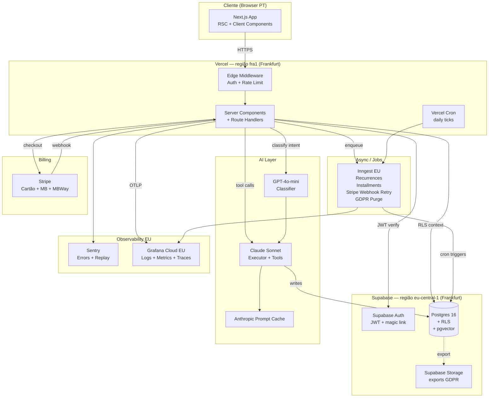
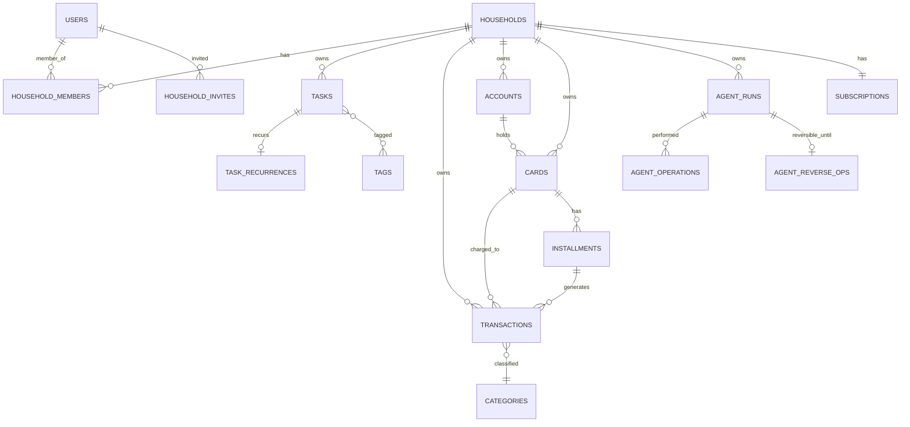
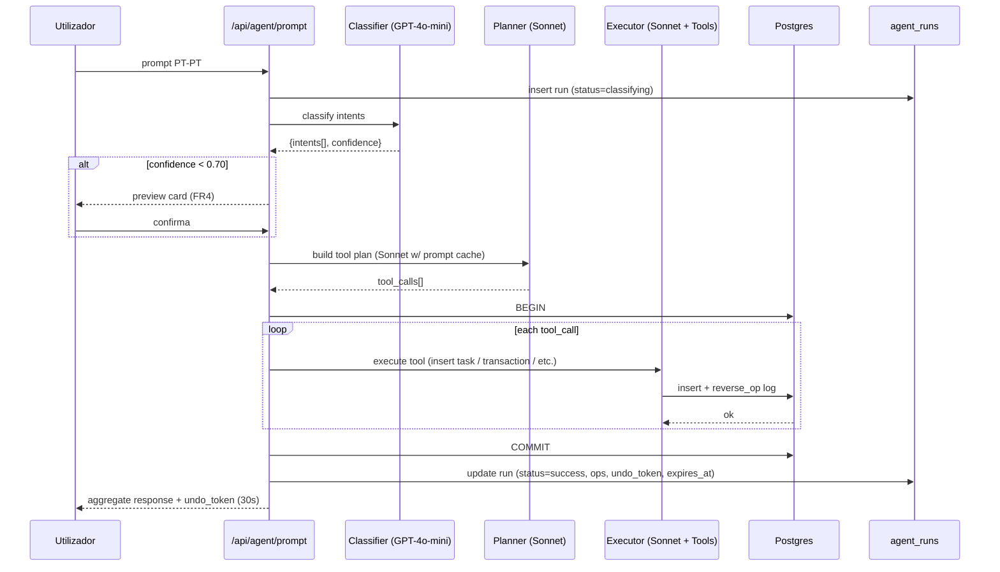

# meu-jarvis — Documento de Arquitectura Fullstack

**Autora:** Aria (Architect AIOX)
**Data:** 2026-05-04
**Versão:** 1.0 (MVP Fase 1)
**Estado:** Draft (pré-validação @qa, pré-handoff @data-engineer)
**Inputs:** `docs/prd.md` v1.1, `docs/project-brief.md` v1.1, `docs/research/01-competitive-analysis.md`, memórias do projecto.

> **Constraint inegociável:** PT-PT exclusivo, mercado Portugal exclusivo, EUR formato `€8,88`, data residency UE obrigatória.
> **Article IV — No Invention:** toda decisão técnica deste documento é rastreável a um FR/NFR/CON do PRD ou a research consolidado. Onde o PRD deferiu para `@architect`, a justificação está aqui.

---

## 1. Visão Geral Arquitectónica

### 1.1 Resumo Técnico

O `meu-jarvis` é um **monolito serverless** sobre **Next.js 15 (App Router) + TypeScript strict**, com **PostgreSQL multi-tenant via RLS** como única fonte de verdade transaccional. O cérebro AI é uma **pipeline de três estágios** (classificador barato → planner → executor multi-intent com tool calling) sobre **Anthropic Claude Sonnet** (executor) e **OpenAI GPT-4o-mini** (classificador), orquestrada via tool registry tipado e suportada por mecanismo de **preview-then-confirm** abaixo de 70% de confiança e **undo de 30 segundos** baseado em log de operações reversíveis. A plataforma assenta em **Vercel (Frankfurt)** para Next.js + edge + cron, **Supabase (Frankfurt)** para Postgres + Auth + Storage + pgvector, **Inngest (EU)** para background jobs idempotentes, **Stripe** para billing com payment methods PT (cartão, Multibanco, MB Way), e **Sentry + Vercel Observability + OTel→Grafana Cloud EU** para telemetria. A arquitectura cumpre os OKRs do PRD (latência p95 multi-intent <6s, RLS sem leaks, custo LLM <30% MRR Pessoal) e mantém burn rate compatível com bootstrap inicial até ao primeiro 1.000 households.

### 1.2 Diagrama Lógico de Alto Nível



### 1.3 Fluxos Críticos

| Fluxo | Sequência |
|-------|-----------|
| **Prompt multi-intent** | Cliente → Edge auth → POST `/api/agent/prompt` → classifier (GPT-4o-mini) → tool plan (Sonnet) → preview-gate (se <70%) → execute em transacção PG → audit log → undo token (30s) → resposta agregada |
| **Recorrência tarefa/finança** | Inngest cron 03:00 UTC → query `recurrences WHERE next_run <= now()` → gera instâncias → marca `next_run` → notifica via UI |
| **Stripe webhook** | Stripe → POST `/api/billing/webhook` → verify signature → enqueue Inngest event → idempotent handler → update `subscriptions` + `households.plan` → audit |
| **Undo (30s)** | Cliente clica undo → POST `/api/agent/prompt/{run_id}/undo` → lê `agent_reverse_ops` (com `executed_at IS NULL`) → executa transacção inversa → marca `executed_at` (row-level) + `agent_runs.reverted_at` (run-level) |
| **Export GDPR** | Cliente pede export → enqueue Inngest job → query todas tabelas com `household_id` → escreve ZIP (JSON+CSV) em Supabase Storage → email signed URL (24h) |

---

## 2. Tech Stack Consolidado

| Categoria | Tecnologia | Versão Alvo | Propósito | Justificação (rastreável) |
|-----------|------------|-------------|-----------|---------------------------|
| Frontend Framework | **Next.js** | 15.x (App Router) | UI + RSC + route handlers + middleware | CON1, tech_stack.md |
| Linguagem | **TypeScript** strict | 5.5+ | Type safety fullstack | CON1, NFR16-19 |
| UI Library | **shadcn/ui + Radix** | latest | Primitivos acessíveis WCAG | NFR FR22, 3.4 WCAG AA |
| Styling | **Tailwind CSS** | 4.x | DX rápida + tokens centralizados | Standard ecossistema Next.js 15 |
| State Management | **TanStack Query + Zustand** | 5.x / 4.x | Server cache (Query) + UI state local (Zustand) | RSC para data, Query para mutations, Zustand para chat panel + undo toast |
| Backend Framework | **Next.js Route Handlers + Server Actions** | 15.x | API monolítica | 4.2 monolito serverless |
| Linguagem Backend | **TypeScript / Node 20+** | 20 LTS | Mesma linguagem fullstack | tech_stack.md |
| API Style | **REST + Server Actions** | — | Server Actions para forms internos, REST para webhooks/agent/billing | Pragmático: Actions evita boilerplate, REST onde stable contract |
| Database | **PostgreSQL 16 (Supabase)** | 16 | Storage transaccional + pgvector + RLS | CON1, NFR5, FR26, NFR11 |
| ORM | **Drizzle ORM** | 0.34+ | Type-safe queries + raw SQL escape hatch | Decisão Aria (§14.1) |
| Cache (LLM) | **Anthropic Prompt Caching + Upstash Redis EU** | — | Cache de system prompts + intents repetidos | NFR20, NFR21 |
| File Storage | **Supabase Storage (eu-central-1)** | — | Exports GDPR + futuro OCR | FR28, NFR11 |
| Authentication | **Supabase Auth** | latest | JWT + RLS via `auth.uid()` | Decisão Aria (§14.2) |
| Background Jobs | **Inngest (EU region)** | latest | Recorrências, prestações, Stripe retry, GDPR purge | Decisão Aria (§14.5) |
| Cron simples | **Vercel Cron** | — | Trigger diário do Inngest (`/api/cron/daily`) | Free tier suficiente |
| Frontend Testing | **Vitest + Testing Library** | 2.x | Unit + component | NFR16, NFR17 |
| Backend Testing | **Vitest + Testcontainers (Postgres)** | 2.x | Unit + integration com PG efémero + RLS | NFR5, NFR16 |
| E2E Testing | **Playwright** | 1.48+ | Fluxos críticos: registo→onboarding→prompt→upgrade | PRD 4.3 |
| RLS Testing | **pgTAP + custom harness Drizzle** | — | Bloqueia merge se nova tabela `household_id` sem policy | NFR5 — gate obrigatório |
| LLM Benchmark | **Custom harness (`packages/agent-bench`)** | — | 200 prompts PT-PT curated → precisão >=90% | Epic 2 AC6 |
| Build Tool | **Turbo + Next.js compiler** | 2.x | Monorepo task graph + cache | Standard pnpm+Turbo |
| Bundler | **Next.js (Turbopack prod)** | — | Built-in | Default Next.js 15 |
| Package Manager | **pnpm** | 9.x | Workspaces + content-addressable store | tech_stack.md, eficiência |
| IaC | **Terraform** (mínimo) | 1.9+ | Provisioning Supabase project + Vercel domain + secrets | Reproducibilidade |
| CI/CD | **GitHub Actions** | — | lint+typecheck+test+RLS-gate+e2e gates | NFR17, NFR24 |
| Error Tracking | **Sentry** (UE region) | latest | Errors + session replay (PII redacted) | NFR12, NFR13 |
| Telemetria | **`@vercel/otel` (wrapper OTel) → Grafana Cloud (EU)** | `@vercel/otel` 1.10.x sobre OTel API 1.9.x | Métricas + traces + logs estruturados; `@vercel/otel` é o wrapper canónico Vercel para Next.js 15 — auto-instrumenta HTTP/fetch/Next routing e trata cold-start serverless | NFR13, NFR14, NFR15 |
| Frontend RUM | **Vercel Observability** | — | Web Vitals + RUM | NFR4, NFR14 |
| Feature Flags | **Postgres-backed (`feature_flags` table) + plan-derived flags** | — | Simples, sem vendor extra | PRD 4.4 |
| Email transaccional | **Resend (EU)** | — | Confirmação email, faltaria de webhook, recuperação | FR24, FR35 |
| Billing | **Stripe** | API 2025-06 | Cartão + Multibanco + MB Way | FR32-36 |
| Hosting | **Vercel** (fra1) + **Supabase** (eu-central-1) | — | Vercel Pro $20/seat | NFR11 data residency UE |

---

## 3. Arquitectura de Dados

### 3.1 Schema Lógico de Alto Nível

> DDL detalhado é responsabilidade de **@data-engineer (Dara)**. Esta secção fixa o schema lógico, relações, e o RLS pattern.

**Domínios:**



**Grupos de tabelas:**

| Grupo | Tabelas (lógicas) | Notas |
|-------|-------------------|-------|
| Identidade | `users` (gerido por Supabase Auth), `households`, `household_members`, `household_invites` | `household_members.role` ∈ {owner, admin, member} |
| Billing | `subscriptions`, `invoices`, `payment_events` | `subscriptions.plan` ∈ {free, pessoal, familia, pro}; `subscriptions.status` ∈ {trialing, active, past_due, canceled} |
| Tarefas | `tasks`, `task_recurrences`, `tags`, `task_tags`, `kanban_columns` | `kanban_columns` por household (FR9) |
| Finanças | `categories`, `accounts`, `cards`, `transactions`, `recurrences`, `installments` | `transactions.amount_cents` integer (€ cêntimos), `currency` fixo `EUR` (CON9) |
| Agente | `agent_runs`, `agent_operations`, `agent_reverse_ops`, `intent_classifications`, `agent_quotas` | Audit imutável (NFR9, FR3) |
| GDPR | `data_export_jobs`, `account_deletion_jobs`, `audit_log` | FR28, FR29, NFR9 |
| Sistema | `feature_flags`, `system_settings` | |

**Convenções obrigatórias (todas as tabelas de domínio):**

| Coluna | Tipo | Obrigatória em |
|--------|------|----------------|
| `id` | `uuid` (gen_random_uuid) | Todas |
| `household_id` | `uuid` FK → `households.id` ON DELETE CASCADE | Todas as tabelas de domínio (excepto `users`, `households`, `household_invites`) |
| `created_at` | `timestamptz default now()` | Todas |
| `updated_at` | `timestamptz default now()` | Todas (trigger `set_updated_at`) |
| `created_by` | `uuid` FK → `users.id` | Tabelas com origem clara de autoria (tasks, transactions, agent_runs) |

### 3.2 RLS Pattern e Template de Policy

**Princípio (NFR5):** toda a tabela com `household_id` tem RLS activa, com policies idempotentes e cobertas por testes.

**Helper SQL canónico** (cria-se uma vez, é usado em todas as policies):

```sql
-- packages/db/migrations/000_rls_helpers.sql
create or replace function public.current_household_id()
returns uuid
language sql
stable
security definer
set search_path = public
as $$
  select coalesce(
    nullif(current_setting('request.jwt.claims', true)::json->>'household_id', ''),
    nullif(current_setting('app.current_household_id', true), '')
  )::uuid
$$;

create or replace function public.is_household_member(target_household uuid)
returns boolean
language sql
stable
security definer
set search_path = public
as $$
  select exists (
    select 1
    from public.household_members hm
    where hm.user_id = auth.uid()
      and hm.household_id = target_household
  )
$$;
```

**Template de policy (aplicado a CADA tabela com `household_id`):**

```sql
-- Exemplo: tasks
alter table public.tasks enable row level security;
alter table public.tasks force row level security;

create policy "tasks_select_household_members"
  on public.tasks for select
  using (public.is_household_member(household_id));

create policy "tasks_insert_household_members"
  on public.tasks for insert
  with check (public.is_household_member(household_id));

create policy "tasks_update_household_members"
  on public.tasks for update
  using (public.is_household_member(household_id))
  with check (public.is_household_member(household_id));

create policy "tasks_delete_household_owner_admin"
  on public.tasks for delete
  using (
    exists (
      select 1 from public.household_members hm
      where hm.user_id = auth.uid()
        and hm.household_id = tasks.household_id
        and hm.role in ('owner', 'admin')
    )
  );
```

**RLS Coverage Gate (CI):** script `scripts/check-rls.ts` enumera tabelas com coluna `household_id`, verifica `pg_policies` e falha o build se faltar policy. **NFR5 implementado como bloqueio de merge.**

### 3.3 Migrations Strategy

| Decisão | Detalhe |
|---------|---------|
| Ferramenta | `drizzle-kit generate` produz SQL versionado em `packages/db/migrations/` |
| Numeração | sequencial `NNNN_descricao.sql` (ex: `0001_initial.sql`, `0002_tasks.sql`) |
| Versioning DB | Tabela `__drizzle_migrations` com hash + timestamp |
| Down migrations | **NÃO** se mantêm (risco em prod) — usar nova migration forward para reverter |
| Apply local | `pnpm db:migrate` executado contra Postgres local Docker |
| Apply staging/prod | GitHub Action `migrate.yaml` com approval gate manual; usa `DATABASE_URL` de Supabase Pooler |
| RLS-first | Cada migration que cria tabela com `household_id` **deve** incluir as 4 policies do template; CI bloqueia |
| Rollback | Restore via Supabase PITR (Point-in-Time Recovery, retenção 7d em plano Supabase Pro) |

---

## 4. Arquitectura do Cérebro AI

### 4.1 Pipeline em 3 Estágios



### 4.2 Classifier — GPT-4o-mini (Estágio 1)

**Custo:** ~$0.15/1M input, $0.60/1M output. Para um prompt típico (~150 tokens in, 50 out) custa ~€0.00006 = praticamente desprezável.

**Saída tipada (Zod):**

```ts
// packages/agent/src/contracts.ts
export const IntentSchema = z.enum([
  'criar_tarefa',
  'criar_financa_variavel',
  'criar_financa_recorrente',
  'criar_cartao',
  'criar_parcelada',
  'consultar_dados',
  'cancelar_ultima',
  'unknown',
]);

export const ClassificationSchema = z.object({
  intents: z.array(z.object({
    intent: IntentSchema,
    confidence: z.number().min(0).max(1),
    raw_span: z.string(), // sub-string do prompt que originou esta intent
  })).min(1),
  language: z.literal('pt-PT'),
  needs_confirmation: z.boolean(), // true se algum confidence < 0.70
});
```

**Prompt do classifier (versionado em `packages/agent/prompts/classifier.v1.md`):** instruction-tuned para PT-PT, com exemplos curated do conjunto de 200 (Epic 2 Story 2.9). Validação com `zod` na resposta — qualquer deriva → retry 1× com temperature=0 ou cair em `unknown`.

### 4.3 Planner + Executor — Claude Sonnet (Estágio 2+3)

**Por que Sonnet (e não Opus):** PRD CON e research validam Sonnet como sweet spot custo/precisão para function calling PT-PT em 2026 (Sonnet 4.5/5 actual). Opus reservado para casos analíticos complexos (FR5) com fallback condicional.

**Tool registry como single source of truth:**

```ts
// packages/agent/src/tools/registry.ts
export interface ToolDefinition<I, O> {
  name: string;                         // 'create_task', 'create_finance_variable'...
  description: string;                  // PT-PT, descreve quando usar
  inputSchema: z.ZodType<I>;            // valida args do LLM
  outputSchema: z.ZodType<O>;
  preview: (input: I, ctx: AgentContext) => string;   // texto humano para preview card
  execute: (input: I, ctx: AgentContext, tx: PgTx) => Promise<O>;
  reverse: (output: O, ctx: AgentContext, tx: PgTx) => Promise<void>; // p/ undo
  requiredPlan?: PlanTier;              // ex: 'criar_parcelada' só Pessoal+
  estimatedCostTokens?: number;
}

export const toolRegistry = {
  create_task: createTaskTool,
  create_finance_variable: createFinanceVariableTool,
  create_finance_recurrence: createFinanceRecurrenceTool,
  create_card: createCardTool,
  create_installment: createInstallmentTool,
  query_finance_summary: queryFinanceSummaryTool,
  query_tasks: queryTasksTool,
  // ...
} as const satisfies Record<string, ToolDefinition<any, any>>;
```

**Anthropic prompt caching:** o system prompt + tool definitions JSON (~3-5k tokens) são marcados com `cache_control: ephemeral`. **Cache hit reduz input cost em ~90%** após o primeiro request por cada 5min de inactividade. Em regime estacionário, custo médio dominado por output tokens (poucos por resposta).

### 4.4 Preview-then-Confirm Flow (FR4)

```ts
// fluxo lógico
const classification = await classify(prompt, ctx);
if (classification.needs_confirmation || ctx.userPrefs.alwaysPreview) {
  const plan = await plan(prompt, classification, ctx); // sem executar
  return { type: 'preview', plan, previewToken: signPreview(plan) };
}
return await executeAtomic(plan, ctx);
```

UI (Epic 5): cartão com lista de operações ("Vais criar: 1 tarefa, 1 transacção de €78,70…") + botões "Confirmar" / "Editar" / "Cancelar". Preview token assinado HMAC válido 5 min.

### 4.5 Undo Mechanism (FR6, 30s)

**Princípio:** cada tool `execute` produz simultaneamente um **`reverse_op`** declarativo, persistido em `agent_reverse_ops` com `expires_at = now() + interval '30 seconds'`.

**Tabela:**

```sql
agent_reverse_ops (
  id uuid pk,
  agent_run_id uuid fk,
  household_id uuid not null,
  reverse_op jsonb not null, -- { kind: 'delete_row', table: 'tasks', id: 'uuid' } ou { kind: 'restore_row', table, snapshot }
  expires_at timestamptz not null,
  reverted_at timestamptz null,
  created_at timestamptz default now()
)
```

**Tipos suportados:** `delete_row` (insert reverte com delete), `restore_row` (update reverte com snapshot prévio), `composite` (lista de ops).

**Endpoints (nested REST sob `/api/agent/prompt/[runId]/`):**
- `POST /api/agent/prompt/{run_id}/undo` — valida ownership + `expires_at > now()` + `executed_at IS NULL` em `agent_reverse_ops`, executa transacção inversa, marca `executed_at` (row-level) e `agent_runs.reverted_at` (run-level). **Não** se permite re-do (KISS para MVP).
- `POST /api/agent/prompt/{run_id}/confirm` — confirma execução de uma run em `status='pending_preview'` dentro de 5min (D20). Re-executa Planner+Executor com `intents_detected` JSONB persistido.

**Decisão de path (Story 2.6 D21 + DOC-FIX-001):** Adoptado nested REST sob `/api/agent/prompt/[runId]/{confirm|undo}` — Next.js App Router idiomático com co-localização (file-based routing) + discoverability via `confirmation_url`/`undo_url` retornados pelo endpoint principal (HATEOAS-style). Substitui versão anterior flat `/api/agent/undo/{token}` que misturava `token` (genérico) com `run_id` (explícito).

**Coluna real de marcação (DOC-FIX-001):** O campo na tabela `agent_reverse_ops` é `executed_at` (row-level — marca que o reverse op foi aplicado), distinto de `agent_runs.reverted_at` (run-level — marca que a run foi revertida). Story 2.3 introduziu o nome correcto; documentação prévia tinha drift histórico.

**Job Inngest:** limpa `agent_reverse_ops` com `expires_at < now() - 1h` diariamente.

### 4.6 Cost Router e Quotas

**Algoritmo de routing:**

```
prompt arrives
  ├─ check Upstash Redis cache key = sha256(normalize(prompt) + household_plan)
  │   └─ HIT (5min TTL) → return cached response  [classifier-only path]
  │
  ├─ classify (GPT-4o-mini)  [€0.00006]
  │
  ├─ if intents == [consultar_dados] AND read-only → query DB direct, no executor
  │
  ├─ else execute via Sonnet w/ prompt cache  [€0.001-0.005 dependendo de tokens]
  │
  └─ atomic increment agent_quotas.tokens_used + .prompts_used
       └─ if exceeded plan quota → reject 429 com mensagem PT-PT
```

**Quotas por plano (NFR20):**

| Plano | Prompts/mês | Tokens-out/mês (soft) | Custo LLM alvo (€/mês) |
|-------|-------------|----------------------|------------------------|
| Free | 50 | 50k | €0,05 |
| Pessoal (€4,90) | 1.500 | 1,5M | €1,47 (30% MRR) |
| Família (€8,88) | 3.000 | 3M | €2,66 (30% MRR) |
| Pro (€14,90) | 10.000 | 10M | €4,47 (30% MRR) |

Reset mensal alinhado a `subscriptions.current_period_start`. Hard-stop a 110% para evitar abuso. **Métrica `agent.cost.eur_per_household` é alarme em Grafana se >35% MRR rolling 7d.**

---

## 5. Auth e Multi-Tenancy

### 5.1 Provider — Supabase Auth (decisão §14.2)

**Why:** integração nativa com RLS — `auth.uid()` está disponível em qualquer policy SQL sem código extra; reduz surface area para erros multi-tenant. JWT contém `sub` (user_id); custom claim `household_id` injectado via Auth Hook (database function) para fast-path nas policies.

### 5.2 Sessão e Auth Hook

```sql
-- packages/db/migrations/0010_auth_hook.sql
create or replace function public.custom_access_token_hook(event jsonb)
returns jsonb
language plpgsql
stable
as $$
declare
  claims jsonb;
  default_household uuid;
begin
  claims := event->'claims';
  -- household_id default = primeiro membership do user
  select hm.household_id into default_household
  from public.household_members hm
  where hm.user_id = (event->>'user_id')::uuid
  order by hm.joined_at asc  -- coluna canónica em household_members (corrigido 2026-05-06 vs versão 1.0 que dizia created_at)
  limit 1;

  if default_household is not null then
    claims := jsonb_set(claims, '{household_id}', to_jsonb(default_household));
  end if;
  return jsonb_set(event, '{claims}', claims);
end;
$$;
-- Registar hook em Supabase Dashboard → Auth → Hooks
```

**Mudança de household activo (Pro/Família com multi-household no Pro):** endpoint `POST /api/auth/switch-household` valida membership, reescreve JWT (refresh) com novo `household_id` claim.

### 5.3 Convites (FR27)

```
1. Owner/admin → POST /api/household/invites { email, role }
2. Servidor: insert household_invites { token: random_bytes(32), expires_at: now+7d }
3. Resend envia email com link `/aceitar-convite/{token}`
4. Convidado clica → se não tem conta, fluxo registo → após confirmação, accept_invite()
5. Função SQL accept_invite(token, user_id):
   - valida limite do plano: count(members) < plan_limit
   - insert household_members
   - delete invite
   - retorna household_id
```

**Limites por plano:** Pessoal=1, Família=4, Pro=10 (FR27). Bloqueio enforced em SQL function (defesa em profundidade vs RLS) e na UI.

### 5.4 Password & MFA

| Item | Política |
|------|----------|
| Hashing | bcrypt cost 12 (Supabase Auth default — cumpre NFR6) |
| MFA | TOTP opt-in disponível desde MVP (Supabase Auth nativo); obrigatório para owners de Pro |
| Sessions | JWT 1h, refresh 30d com rotation |
| Recuperação | Magic link via Resend |

---

## 6. Billing Flow

### 6.1 Modelo Stripe

**Produtos:**

| Stripe Product | Stripe Prices | Plano interno |
|----------------|---------------|---------------|
| `prod_meu_jarvis_pessoal` | `price_pessoal_mensal_eur` (€4,90), `price_pessoal_anual_eur` (€49,00) | pessoal |
| `prod_meu_jarvis_familia` | `price_familia_mensal_eur` (€8,88), `price_familia_anual_eur` (€89,00) | familia |
| `prod_meu_jarvis_pro` | `price_pro_mensal_eur` (€14,90), `price_pro_anual_eur` (€149,00) | pro |

Plano Free não tem product Stripe — é estado interno. Trial 14d activado em `subscriptions.status='trialing'` sem Stripe customer.

### 6.2 Payment Methods PT (FR36)

Stripe Checkout configurado com `payment_method_types: ['card', 'multibanco', 'sofort']` e ativando MB Way via Stripe Dashboard (PT region). **Multibanco** gera entidade+referência (3-7 dias para confirmar). **MB Way** confirma em segundos. Estado da subscrição respeita `payment_intent.status` — `requires_action`/`processing` → `subscriptions.status='past_due_pending'` no nosso lado, com UI de "aguardar pagamento".

### 6.3 Webhook Handler

```
POST /api/billing/webhook
  ├─ verify Stripe-Signature (raw body)
  ├─ idempotency: upsert payment_events { stripe_event_id PK }, on conflict do nothing
  ├─ if duplicate → 200
  ├─ enqueue Inngest 'stripe.event' { event }
  └─ return 200 imediatamente (Stripe re-tenta se não 2xx em 30s)
```

**Eventos tratados (Inngest):**

| Evento Stripe | Acção |
|---------------|-------|
| `customer.subscription.created` | upsert `subscriptions`, derive `households.plan` |
| `customer.subscription.updated` | update plan, status, current_period_end, member quota |
| `customer.subscription.deleted` | downgrade household para Free no fim do período |
| `invoice.paid` | gera factura electrónica PT (NIF), envia email |
| `invoice.payment_failed` | status=past_due, dunning email +0d/+3d/+7d |
| `payment_intent.processing` | status=past_due_pending (Multibanco) |

**Idempotência:** `stripe_event_id` é PK na tabela `payment_events`. Inngest também tem own idempotency key `stripe:{event_id}`.

### 6.4 Trial 14 dias (FR33)

Activado **no servidor**, sem Stripe customer:

```
on user signup:
  insert households {...}
  insert subscriptions {
    plan: 'familia',  -- trial dá Família para evitar amputação durante 14d
    status: 'trialing',
    trial_ends_at: now() + 14 days,
    current_period_end: now() + 14 days
  }
```

Job Inngest diário `expire-trials` query `subscriptions WHERE status='trialing' AND trial_ends_at < now()` → set plan='free', status='active', notifica utilizador via email + UI banner com CTA upgrade.

### 6.5 Mudança de Plano Pro-Rata (FR34)

Stripe nativo: `subscriptions.update({proration_behavior: 'create_prorations'})`. Upgrade aplica imediato (acesso novo plano + cobrança proporcional na próxima factura). Downgrade aplica `cancel_at_period_end` ou novo plano após `current_period_end`.

**Edge case Família→Pessoal com >1 membro:** UI bloqueia downgrade até remover membros excedentes; mensagem PT-PT clara.

### 6.6 Factura Electrónica PT (FR35)

**MVP:** Stripe Tax + custom_fields para NIF; PDF gerado pelo Stripe inclui NIF do cliente quando fornecido. Numeração sequencial via `invoices.invoice_number` (formato `FT 2026/0001`).

**Compliance AT (Autoridade Tributária):** comunicação via SAF-T export mensal (manual no MVP, automatizado Fase 2). Documentação em `docs/compliance/at-pt.md` (a criar pelo @data-engineer).

**Limitação assumida:** MVP não emite recibo certificado AT inline — utilizadores que precisem de factura para IRS usam o PDF Stripe + comunicam via Portal AT manualmente. **Acceptable risk** dado mercado-alvo (B2C, não freelancers profissionais que requerem certificação inline). Persona Inês (freelancer) mantém-se com produto upstream específico (referenciado no PRD).

---

## 7. API Design

### 7.1 Convenções

| Tipo de operação | Padrão |
|------------------|--------|
| Forms internos (criar tarefa via UI) | **Server Actions** (`'use server'`) |
| Endpoints públicos contractuais (agent, billing, webhooks) | **Route Handlers** REST em `app/api/**/route.ts` |
| Background-triggered | **Inngest functions** em `inngest/functions/**` |
| Read pesado dashboard | **RSC fetch direct from DB** (server component, sem API) |

**Naming:**
- Routes: `/api/{domain}/{resource}` em kebab-case (ex: `/api/agent/prompt`, `/api/household/invites`)
- Server Actions: `createTaskAction`, `updateTaskAction` (suffix `Action`)
- Tools agent: `snake_case` (consumido por LLM, idiomático para function calling)

### 7.2 Rate Limiting

**Upstash Redis EU + sliding window:**

| Endpoint | Limite | Reset |
|----------|--------|-------|
| `/api/agent/prompt` | quota mensal por household + 10 req/min burst | min/mês |
| `/api/auth/*` | 5 req/min por IP | min |
| `/api/billing/webhook` | sem limite (Stripe verificado por signature) | — |
| Geral | 60 req/min por user | min |

Implementado como **edge middleware** (`middleware.ts`) — parar antes de hit handler.

### 7.3 Error Handling Padronizado

```ts
// packages/shared/src/errors.ts
export type ApiError = {
  error: {
    code: string;       // 'AGENT_QUOTA_EXCEEDED', 'RLS_DENIED', 'VALIDATION_ERROR'
    message: string;    // mensagem user-facing PT-PT
    details?: Record<string, unknown>;
    timestamp: string;  // ISO-8601
    requestId: string;  // correlationId OTel
  };
};
```

Wrapper em `lib/api-handler.ts` envolve cada handler — captura `ZodError` → 400, `RlsError` → 403, `AuthError` → 401, `AgentQuotaError` → 429, default → 500 com Sentry capture. **Nunca** expor stack traces ao cliente.

---

## 8. Frontend Architecture

### 8.1 App Router Structure (route groups)

```
apps/web/src/app/
├── (marketing)/                     # public, sem auth — landing, pricing, blog
│   ├── page.tsx
│   ├── precos/page.tsx
│   └── politica-privacidade/page.tsx
├── (auth)/                          # public, no chrome
│   ├── entrar/page.tsx
│   ├── registar/page.tsx
│   ├── recuperar/page.tsx
│   └── aceitar-convite/[token]/page.tsx
├── (app)/                           # auth-required, app shell
│   ├── layout.tsx                   # sidebar + chat panel + topbar
│   ├── visao/page.tsx
│   ├── chat/page.tsx
│   ├── tarefas/
│   │   ├── lista/page.tsx
│   │   ├── kanban/page.tsx
│   │   └── calendario/page.tsx
│   ├── financas/
│   │   ├── este-mes/page.tsx
│   │   ├── variaveis/page.tsx
│   │   ├── recorrentes/page.tsx
│   │   ├── cartoes/page.tsx
│   │   └── patrimonio/page.tsx
│   └── conta/
│       ├── perfil/page.tsx
│       ├── plano/page.tsx
│       ├── household/page.tsx
│       └── exportar/page.tsx
├── api/
│   ├── agent/prompt/route.ts
│   ├── agent/prompt/[runId]/confirm/route.ts
│   ├── agent/prompt/[runId]/undo/route.ts
│   ├── billing/webhook/route.ts
│   ├── auth/switch-household/route.ts
│   ├── household/invites/route.ts
│   ├── exports/[jobId]/route.ts
│   └── cron/daily/route.ts
├── (onboarding)/
│   └── onboarding/[step]/page.tsx
├── middleware.ts                    # auth gate + rate limit
├── error.tsx
└── not-found.tsx
```

### 8.2 Server vs Client Components

**Default: Server Component.** Client Component (`'use client'`) apenas para:
- Componentes com state local (chat input, toast undo, drag-and-drop)
- Componentes com hooks de browser (theme toggle, IntersectionObserver)
- Wrappers de TanStack Query (mutations no client)

**Padrão híbrido:** página é Server Component que faz fetch direct do Postgres via Drizzle, passa data tipada a Client Component que gere interactividade.

### 8.3 State Management

| Tipo de state | Solução | Razão |
|---------------|---------|-------|
| Server data (queries) | RSC + revalidate | Cache HTTP nativo Next.js, sem hydration |
| Server data (mutations + optimistic) | TanStack Query 5 | Optimistic updates p/ Kanban drag, refetch automático |
| Chat (streaming) | Vercel AI SDK `useChat` (client) | Streaming SSE built-in |
| UI ephemeral (modals, sidebar collapse, theme) | Zustand | Persist `theme` em `localStorage` (FR22) |
| Form | React Hook Form + Zod resolver | Type-safe + valida Server Action input |
| Undo toast | Zustand store `undoStore` (token + expires_at) | Cross-component, simples |

### 8.4 Component Patterns

```
packages/ui/                          # design system shared
├── primitives/                       # shadcn unmodified
├── components/                       # composições (TaskCard, MoneyDisplay)
│   └── MoneyDisplay.tsx              # SEMPRE format PT-PT €1.234,56
└── tokens.ts                         # cores, espaçamentos

apps/web/src/components/
├── chat/                             # ChatPanel, MessageList, PreviewCard, UndoToast
├── tasks/                            # TaskList, TaskKanban, TaskCalendar
├── finance/                          # MonthOverview, CardStatement, NetWorthCard
├── household/                        # InviteForm, MembersList
└── visao/                            # WidgetGrid, widgets/*
```

**Regra absoluta:** todo `MoneyDisplay`, `DateDisplay`, `RecurrenceDisplay` é centralizado em `packages/ui` e usa `Intl.NumberFormat('pt-PT', { style: 'currency', currency: 'EUR' })` e `Intl.DateTimeFormat('pt-PT')`. Nunca inline formatting (CON3, CON9).

### 8.5 Streaming do chat

Vercel AI SDK 4 + Anthropic provider, streaming SSE. Tool calls intermédios são exibidos como "loading actions" inline; resposta final é o aggregate summary.

---

## 9. Observability

### 9.1 Stack — Decisão §14.4

| Camada | Provider | Região | Razão |
|--------|----------|--------|-------|
| RUM / Web Vitals | Vercel Observability | UE | built-in, zero overhead |
| Errors + Replay | Sentry (EU data residency) | UE | DX premium, replay com PII redaction |
| Métricas + Traces + Logs | `@vercel/otel` (wrapper OTel) → Grafana Cloud (EU) | UE | open standard, custo previsível, evita lock-in vendor; wrapper Vercel canónico para Next 15 (auto-instrumentação serverless, cold-start tratado, lê env vars OTLP directamente) |

**Why não Honeycomb (avaliado):** óptima DX para tracing mas custo mensal mínimo ($100+) excessivo para MVP; região US-default cria fricção GDPR; Grafana Cloud tem free tier com 10k metrics + 50GB logs em EU que serve até ~5k households.

**Why não Vercel Observability sozinho:** cobre Next.js mas não Inngest functions e não exporta para tools de alarmismo personalizado.

### 9.2 Métricas-Chave (NFR14)

| Métrica | Source | Alarme |
|---------|--------|--------|
| `agent.latency.p95` | OTel histogram em `/api/agent/prompt` | >10s em 5min → PagerDuty (NFR15) |
| `agent.intent_accuracy` | benchmark daily sobre 200 prompts | <88% → ticket auto |
| `agent.cost.eur_per_household_24h` | Stripe-grade audit em `agent_quotas` | >35% MRR rolling 7d → alarme |
| `rls.policy_violations_total` | log de RLS errors | >0 → CRITICAL |
| `billing.webhook_failures` | Stripe events que falharam após retries Inngest | >0 → alarme |
| `db.query.p95` (por endpoint) | OTel | >300ms sustained → ticket |
| `web.LCP / INP / CLS` | Vercel RUM | LCP>2.5s p75 → ticket |

### 9.3 Traces e Logs

**Trace ID propagation:** `request-id` header gerado em middleware → propagado para Drizzle queries (via `db.transaction({ tracingId })`) e tool calls Anthropic (via `metadata.user_id`). Cada `agent_run` armazena `trace_id` para deep-link Grafana.

**Logs estruturados:** Pino com pretty redactor que apaga `prompt_text`, `email`, `nif` (NFR12). Hash `sha256(prompt + salt)` é loggado para debug correlation sem PII.

### 9.4 Dashboards Essenciais (NFR14)

1. **Agent Health** — latência p50/p95/p99, error rate por intent, cost €/dia, accuracy benchmark
2. **Billing Funnel** — registos→trial→pago por dia/semana, churn, MRR/ARR
3. **Tenant Safety** — RLS denials count, audit log volume, exports/eliminações pedidas
4. **Platform** — Vercel error rate, DB connections, Inngest queue depth

---

## 10. Testing Strategy

### 10.1 Pirâmide

```
         /\
        /E2\        Playwright — fluxos críticos (10-15 testes)
       /----\
      / Int  \      Vitest + Testcontainers PG — RLS, billing webhook, agent (50-80)
     /--------\
    /  Unit    \    Vitest (200+) — packages/agent, packages/finance, packages/tasks
   /------------\
```

### 10.2 RLS Testing Automatizado (NFR5 — bloqueia merge)

**Harness próprio em `packages/db-test/src/rls-harness.ts`:**

```ts
// Para cada tabela com household_id:
test(`RLS isolation: ${table}`, async () => {
  const { householdA, userA, householdB, userB } = await seedTwoHouseholds();
  await asUser(userA, async (db) => {
    await db.insert(table).values({ household_id: householdA, ...sample });
  });
  await asUser(userB, async (db) => {
    const rows = await db.select().from(table).where(...);
    expect(rows).toHaveLength(0);                                  // (1) cross-household select bloqueado
    await expect(db.insert(table).values({ household_id: householdA, ...sample }))
      .rejects.toThrow(/violates row-level security/);             // (2) cross-household insert bloqueado
  });
});
```

CI corre este teste para **TODAS** as tabelas do schema. **Falha CI = falha merge** (NFR5).

### 10.3 LLM Benchmark Suite (Epic 2 AC6)

`packages/agent-bench/` contém:
- `dataset/200-prompts-pt-pt.jsonl` — prompts PT-PT curated com expected intents
- `runner.ts` — corre classifier+executor contra dataset, calcula precision/recall por intent + multi-intent accuracy
- CI nightly job → posta resultado em PR comments + alerta se accuracy <88%

### 10.4 E2E Críticos

| Fluxo | Justificação |
|-------|--------------|
| Registo→trial→primeiro prompt multi-intent→undo | Provar diferenciador-chave funciona |
| Upgrade Pessoal→Família com Multibanco | Provar PT payment methods funcionam |
| Convite household + RLS isolation | Provar segurança fundamental |
| Export GDPR completo | Provar compliance (FR28) |
| Trial expira→fallback Free | Provar billing lifecycle |

---

## 11. Deployment Topology

### 11.1 Vercel Config

```jsonc
// apps/web/vercel.json
{
  "regions": ["fra1"],                          // Frankfurt — UE
  "framework": "nextjs",
  "crons": [
    { "path": "/api/cron/daily", "schedule": "0 3 * * *" }   // 03:00 UTC daily
  ]
}
```

### 11.2 Supabase Project

- Project region: **eu-central-1 (Frankfurt)** — NFR11
- Plan: **Pro** ($25/mês) inicial — inclui PITR 7d, daily backups, 8GB DB, 100GB egress
- Extensions: `pgvector` (Phase 3 prep, NÃO usado no MVP), `pg_stat_statements`, `pgcrypto`
- Auth Hooks: `custom_access_token_hook` registado
- Connection pooling: PgBouncer (transaction mode) para Vercel serverless; `DATABASE_URL` aponta para porta 6543

### 11.3 Inngest

- Region: **EU (Frankfurt)** — Inngest oferece EU residency em plano Pro
- Functions versionadas em `inngest/functions/`, deploy automático via webhook GitHub
- Retry: exponential backoff, max 4 attempts, dead-letter para Sentry após esgotamento

### 11.4 CI/CD Pipeline (GitHub Actions)

```yaml
# .github/workflows/ci.yaml — esquema
on: [pull_request, push to main]
jobs:
  quality:
    - lint (eslint)
    - typecheck (tsc --noEmit)
    - unit tests (vitest)

  rls-gate:                                     # NFR5 — bloqueante
    services: postgres:16
    - drizzle-kit generate (verifica migrations)
    - migrate up
    - run scripts/check-rls.ts
    - run packages/db-test (RLS harness)

  integration:
    services: postgres:16, redis
    - vitest --config integration

  e2e:
    if: pull_request
    - playwright (preview deploy)

  llm-bench:                                    # nightly + on demand
    - run packages/agent-bench
    - upload results.json
    - comment PR if accuracy < 90%

  deploy:                                       # main only
    - migrate-prod (manual approval gate)
    - vercel deploy --prod
```

### 11.5 Rollback (<2 min — NFR24)

- **Frontend/Backend:** Vercel `rollback` instantâneo (alias swap)
- **DB:** Supabase PITR (até 7 dias). **Risco assumido:** rollback DB não-trivial; estratégia primária é forward-fix com nova migration. PITR só para incidents catastróficos com aprovação @aiox-master.

### 11.6 Environments

| Env | URL | DB | Notas |
|-----|-----|----|----|
| Local | localhost:3000 | Postgres Docker | Drizzle migrate seed mock |
| Preview | `*.vercel.app` | Supabase **branch DB** | Cada PR tem branch (Supabase branching) |
| Staging | `staging.meu-jarvis.pt` | Supabase staging project | Stripe test mode, dados mock |
| Production | `meu-jarvis.pt` | Supabase prod project | Stripe live, observability ativa |

---

## 12. Security e Compliance

### 12.1 GDPR Checklist (NFR10)

| Direito GDPR | Implementação |
|--------------|---------------|
| Acesso (Art. 15) | UI `/conta/exportar` lista dados estruturados |
| Portabilidade (Art. 20) | FR28 — endpoint `/api/exports/{jobId}` produz ZIP JSON+CSV |
| Eliminação (Art. 17) | FR29 — `/api/account/delete` agenda Inngest job 30d, hard-purge |
| Rectificação (Art. 16) | UI `/conta/perfil` |
| Oposição/Restrição (Art. 18, 21) | Email DPO publicado |
| Privacy Policy PT-PT | `app/(marketing)/politica-privacidade/page.tsx` antes do launch |
| DPO email | `dpo@meu-jarvis.pt` |
| Data Processing Agreement | Stripe ✓, Supabase ✓, Vercel ✓, Inngest ✓, Anthropic ✓, OpenAI ✓ — todos com DPA assinado e UE region |

### 12.2 Data Residency UE (NFR11)

| Provider | Região configurada |
|----------|-------------------|
| Vercel | `fra1` |
| Supabase | `eu-central-1` |
| Inngest | EU |
| Sentry | EU |
| Grafana Cloud | EU |
| Resend | EU |
| Upstash Redis | `eu-west-1` |
| Stripe | account em PT (sub-processor PT) |
| Anthropic / OpenAI | **Excepção documentada** — APIs sem região UE garantida em 2026; mitigação: nunca enviar PII além do prompt do utilizador (que é PII), DPA assinado, contratado modo "no training" em ambos os providers, hash do prompt em logs, retenção zero pedida via configuração. |

**Risco residual LLM providers:** documentado em `docs/compliance/llm-data-residency.md`. Re-avaliar em Fase 2 com providers com EU region (Mistral, Anthropic EU se anunciada).

### 12.3 Secrets Management (NFR8)

- **Vercel:** Project Env Vars (encrypted at rest)
- **Supabase:** Secrets vault para service_role keys
- **Local dev:** `.env.local` no `.gitignore`, template em `.env.example`
- **Rotation:** trimestral para `STRIPE_SECRET_KEY`, `ANTHROPIC_API_KEY`, `OPENAI_API_KEY`; checklist em `docs/runbooks/secret-rotation.md`

### 12.4 Audit Logs (NFR9)

Tabela `audit_log` append-only, RLS read = household members + admin role:

| Acção registada | Detalhes |
|-----------------|----------|
| `login`, `logout`, `password_change`, `mfa_enabled` | user_id, ip, ua |
| `plan_changed` | from→to, stripe_event_id |
| `data_export_requested`, `data_export_completed` | job_id |
| `account_deletion_requested`, `account_deletion_executed` | job_id |
| `household_invite_sent`, `household_invite_accepted`, `household_member_removed` | targets |

Retenção 12 meses (NFR9). Imutabilidade enforced via `REVOKE UPDATE/DELETE ON audit_log FROM authenticated`.

### 12.5 OWASP Top 10 (resumo)

| Risco | Mitigação |
|-------|-----------|
| A01 Broken Access Control | RLS Postgres + middleware Edge + RLS coverage gate |
| A02 Crypto Failures | TLS 1.2+ enforced (NFR7), bcrypt cost 12, PII redaction logs |
| A03 Injection | Drizzle parameterized queries; Zod input validation em todo handler |
| A04 Insecure Design | Preview-confirm em low-confidence (FR4), undo (FR6) |
| A05 Misconfiguration | Terraform + checklist deploy + CSP headers strict |
| A07 ID & Auth Failures | Supabase Auth (audited), MFA opcional (mandatory Pro owners) |
| A08 Software/Data Integrity | Stripe webhook signature, Inngest idempotency keys |
| A09 Logging Failures | OTel + Sentry + audit_log com retention |
| A10 SSRF | Sem fetches externos a partir de input do utilizador no MVP |

---

## 13. Cost Model

### 13.1 LLM Budget por Plano (NFR20-21)

Modelado para **household activo médio = 50 prompts/dia (Pro), 20 (Família), 5 (Pessoal), 2 (Free)**:

| Plano | Prompts/mês | Classifier (€) | Executor (€) | Total LLM/mês | % MRR |
|-------|-------------|----------------|--------------|---------------|-------|
| Free | ~50 | €0,003 | €0,15 | **€0,15** | — |
| Pessoal €4,90 | ~150 | €0,009 | €0,90 | **€0,91** | **18,5% ✓** |
| Família €8,88 | ~600 | €0,036 | €2,40 | **€2,44** | **27,5% ✓** |
| Pro €14,90 | ~1500 | €0,090 | €4,50 | **€4,59** | **30,8% ⚠** |

> Pro está no limite — mitigação: cache agressiva, prompt caching Anthropic, queries `consultar_dados` resolvidas direct-DB sem executor (poupa ~40% das chamadas).

### 13.2 Infra Estimate (1.000 households activos)

| Componente | Custo/mês | Notas |
|------------|-----------|-------|
| Vercel Pro | ~€80 | Bandwidth + functions + cron |
| Supabase Pro | ~€23 | Plano base; +€10 storage 50GB se ultrapassado |
| Inngest Pro | ~€18 | Steps suficientes para MVP |
| Upstash Redis | ~€10 | Pay-as-you-go |
| Sentry Team | ~€26 | 50k events/mês |
| Grafana Cloud Free | €0 | Tier free aguenta MVP |
| Resend | ~€18 | 50k emails |
| Stripe | 1,4%+€0,25 (UE card), 1,2%+€0,25 (MB), 0,8% (MB Way) | sobre revenue |
| **Total fixo** | **~€175/mês** | + LLM variável |

**Break-even**: ~25 utilizadores Família ativos (€222 MRR > €175 + €60 LLM ≈ €235). Realista em Q1.

### 13.3 Quotas e Rate Limiting Sumário

Ver §4.6 (LLM) + §7.2 (HTTP). UI mostra quota usada/disponível em `/conta/plano` (NFR20 transparency).

---

## 14. Constraints e ADRs (decisões pendentes fechadas)

> Cada ADR segue o protocolo do skill `architect-first`. Formato curto: contexto, opções, decisão, razão.

### 14.1 ADR-001 — ORM: **Drizzle**

| Opção | Pró | Contra |
|-------|-----|--------|
| **Drizzle** ✓ | TypeScript-first, raw SQL escape hatch (essencial p/ RLS), bundle 50× mais pequeno que Prisma, sem generate step pesado, suporta `.transaction()` com search_path | Ecosistema mais novo |
| Prisma | Maturidade, DX excelente, schema declarativo | Engine binário pesado em serverless cold-start, fricção com RLS (precisa raw SQL para `set local`), versão 6 ainda quebra DX em alguns pontos |

**Decisão:** Drizzle 0.34+. RLS exige raw SQL frequente — Drizzle integra-se sem ginástica. Cold start <50ms vs Prisma ~200ms relevante em Vercel serverless. Trade-off perdido (declarative schema) compensado por `drizzle-kit introspect` + tipos auto-gerados.

### 14.2 ADR-002 — Auth: **Supabase Auth**

| Opção | Pró | Contra |
|-------|-----|--------|
| **Supabase Auth** ✓ | `auth.uid()` nativo nas RLS policies, custom claims via Hook, mesmo provider da DB (single vendor concern), MFA built-in, magic links | Lock-in operacional Supabase (mas DB já é Supabase) |
| Clerk | UX premium, MFA polido | Sem `auth.uid()` em SQL — precisa sync user table; €25/seat fica caro a escala; região UE limitada |
| Auth.js (NextAuth) | Open-source, flexível | Manual heavy-lift para multi-tenant + RLS; sem MFA built-in; sem session replay; mais código a manter |

**Decisão:** Supabase Auth. Sinergia RLS é decisiva — qualquer alternativa exige sync de user table com Postgres + risco de drift. NFR5 (RLS coverage) é mais simples com `auth.uid()` nativo.

### 14.3 ADR-003 — Postgres host: **Supabase**

| Opção | Pró | Contra |
|-------|-----|--------|
| **Supabase** ✓ | Auth+DB+Storage+pgvector+branching+PITR num provedor; região eu-central-1; RLS first-class; CLI excelente; comunidade activa | Lock-in vendor (mitigado por Postgres ser portável); preço sobe rápido com storage |
| Neon | Branching primitives elegantes, scale-to-zero, pricing previsível | Não inclui Auth/Storage — exige Clerk/S3 separados (custo+complexidade); pgvector mais novo |

**Decisão:** Supabase. Em greenfield com prazo MVP de 3-4 meses, single-vendor reduz superfície operacional. Branching DB para previews iguala Neon. Migrar para Neon mais tarde é Postgres-pump-and-restore — custo aceitável se necessário.

### 14.4 ADR-004 — Observability: **Vercel Observability + Sentry + Grafana Cloud (EU) via OTel**

| Opção | Pró | Contra |
|-------|-----|--------|
| **Stack escolhida** ✓ | Free tier Grafana suficiente até ~5k households; Sentry replay com PII redaction; OTel evita lock-in | 3 providers em vez de 1 |
| Honeycomb | DX top em tracing | $100+/mês mínimo; região US default |
| Vercel Observability sozinho | Zero setup | Não cobre Inngest functions; logs limitados |

**Decisão:** stack distribuída com OTel como cola standard. Sentry para erros (DX matter), Grafana para métricas/logs/traces (custo previsível), Vercel para RUM front-end. **Re-avaliação Fase 2** se Honeycomb baixar pricing UE.

### 14.5 ADR-005 — Background jobs: **Inngest**

| Opção | Pró | Contra |
|-------|-----|--------|
| **Inngest** ✓ | Eventos tipados TS, idempotency keys built-in, retry exponential, step functions, EU region, dashboard útil | Vendor extra |
| Vercel Cron sozinho | Built-in, free | Sem retries, sem fan-out, sem step functions — fica frágil para Stripe webhook fan-out e GDPR purge multi-step |
| Supabase Edge Functions + pg_cron | Sem vendor extra | Step functions ausentes, debugging mais hostil, limit 60s execution |

**Decisão:** Inngest para fluxos com retry, fan-out, ou multi-step (Stripe events, GDPR purge, recurrence generation). **Vercel Cron** mantém-se para o tick diário simples que dispara todos os jobs Inngest (`/api/cron/daily`).

### 14.6 ADR-006 — Vector store (Fase 3 prep): **pgvector no Supabase**

| Opção | Pró | Contra |
|-------|-----|--------|
| **pgvector** ✓ | Mesmo Postgres, RLS preserved, sem vendor extra, suficiente até ~milhões de embeddings | Performance HNSW <Pinecone em ultra-scale |
| Pinecone EU | Performance | Custo extra, complexidade RLS-equivalente, nova tier |

**Decisão:** pgvector. Suporta o caso Conhecimento (Fase 3) com dataset esperado <1M embeddings. **MVP apenas activa extension; nenhuma feature usa-a.**

### 14.7 ADR-007 — Function Calling Design

Documentado em §4. Resumo:
- 3 estágios (classifier→planner→executor) com prompt cache Anthropic
- Tool registry tipado em TS com Zod schemas
- Preview-confirm gate <70% confidence (FR4)
- Undo de 30s via `agent_reverse_ops` (FR6)
- Quotas por plano + Redis cache (NFR20)

### 14.8 ADR-008 — Multi-Tenant Pattern

Documentado em §3. Resumo:
- `household_id` em todas tabelas de domínio
- RLS via helpers `current_household_id()` + `is_household_member()`
- 4 policies por tabela (SELECT/INSERT/UPDATE/DELETE)
- CI gate enumera tabelas e bloqueia merge se faltar policy
- JWT custom claim `household_id` para fast-path

### 14.9 ADR-009 — Cost Router

Documentado em §4.6 + §13.1. Resumo:
- GPT-4o-mini classifica, Claude Sonnet executa
- Anthropic prompt caching para -90% input cost
- Redis cache 5min para prompts repetidos
- `consultar_dados` resolvido direct-DB sem executor (poupa ~40% chamadas)
- Quotas por plano com hard-stop a 110%

---

## 15. Próximos Passos

### 15.1 Handoff @data-engineer (Dara)

**Mission:** transformar §3 deste documento em DDL detalhado, com coluna a coluna, índices, constraints, triggers `set_updated_at`, e o conjunto inicial de migrations.

**Inputs:** este documento §3 + PRD FR1-FR36.

**Entregáveis:**
- `docs/db-schema.md` — schema completo com cada tabela, índices, FKs, RLS policies
- `packages/db/migrations/0001_initial.sql` até `0008_billing.sql` — migrations em ordem lógica
- `packages/db/seed.ts` — seed para dev (1 household, 2 users, categorias default PT)
- Validar contra Constitution Article IV (No Invention) e contra `scripts/check-rls.ts`

**Comando:** `@data-engineer *db-domain-modeling`

### 15.2 Handoff @ux-design-expert (Uma) — em paralelo

Já em curso conforme PRD §8.1. Aria pede que a equipa UX tenha em consideração:
- Componentes `MoneyDisplay`, `DateDisplay`, `RecurrenceDisplay` centralizados (§8.4)
- Preview-confirm card como componente padrão do design system
- Undo toast com countdown 30s
- Estado "aguardar pagamento Multibanco" com referência+entidade+valor

### 15.3 Handoff @sm (River) — Stories Epic 1

**Ordem recomendada para Epic 1 (Foundation):**

1. **Story 1.1** — Setup monorepo pnpm + Next.js 15 + TS strict + ESLint + Vitest
2. **Story 1.2** — CI/CD GitHub Actions com gates lint+typecheck+test
3. **Story 1.3** — Supabase project provisioning Frankfurt + Drizzle setup + migration `0001_initial` (households, users, members, invites)
4. **Story 1.4** — RLS helpers + RLS coverage gate + RLS test harness (NFR5 — fundamental antes de qualquer outra tabela)
5. **Story 1.5** — Supabase Auth integration + middleware Edge auth gate + custom_access_token_hook
6. **Story 1.6** — Endpoint canary `/api/me` com teste E2E RLS cross-household
7. **Story 1.7** — OTel SDK + Sentry + Grafana Cloud setup + dashboard mínimo

**Comando:** `@sm *draft 1.1` após este documento ser validado por @qa.

### 15.4 Handoff @devops (Gage)

**Mission concorrente:**
- Provisionar projects Supabase staging + prod (Frankfurt)
- Provisionar Vercel projects + domínio `meu-jarvis.pt`
- Configurar secrets em todos environments
- Provisionar Inngest, Sentry, Grafana, Resend, Upstash com regiões UE
- Documentar em `docs/runbooks/setup-infra.md`

### 15.5 Pontos de Validação com Eurico

Aria flagga estes pontos para validação humana antes de Story 1.1:

| Ponto | Por que precisa validação |
|-------|---------------------------|
| Domínio `meu-jarvis.pt` registado | Bloqueador de deploy preview/staging |
| Conta Stripe PT activa com NIF da entidade | Trial 14d sem cartão exige customer_creation logic; PT entity para faturação |
| DPO email + entidade legal | Privacy policy precisa entidade jurídica responsável |
| Trial 14d dá Família vs Pessoal vs Pro | Decidi Família por default (best UX); Eurico confirmar se concorda |
| Limite de members hard ou soft no downgrade | Bloquear UI vs deixar passar com aviso? Decidi bloquear (segurança orçamento) |

---

*Documento preparado por Aria (Architect AIOX) em 2026-05-04. Pronto para handoff a @data-engineer (DDL detalhado), @sm (Epic 1 stories), @devops (infra) e validação @qa. Toda decisão técnica é rastreável a FR/NFR/CON do PRD ou a research consolidado, conforme Constitution Article IV — No Invention.*
