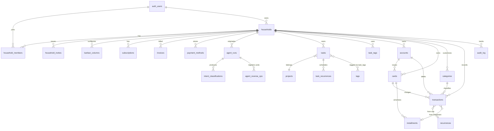

# Schema da Base de Dados — Expressia (codename meu-jarvis)

**Autor:** Dara (@data-engineer), completado por Orion (aiox-master)
**Data:** 2026-05-04
**Versão:** 1.0 (MVP — Fase 1, PT-PT exclusivo)
**Stack:** PostgreSQL 15+ (Supabase eu-central-1, Frankfurt) + Drizzle ORM
**Trace:** PRD `docs/prd.md`, Architecture `docs/architecture.md` §3, ADR-001 a ADR-009

---

## 1. Visão geral

Schema multi-tenant por `household_id` (CON2) para SaaS PT-PT exclusivo. Toda a tabela de domínio:

- Tem `household_id` UUID NOT NULL com FK ON DELETE CASCADE para garantir purge GDPR consistente (NFR10/FR29).
- Tem `created_at` e `updated_at` com timezone.
- Tem RLS Postgres activa via 4 policies (SELECT/INSERT/UPDATE/DELETE) — bloqueante via CI gate (NFR5).
- Usa enums Postgres tipados para colunas categóricas (não lookup tables).
- Tem índices em FKs e queries comuns.

---

## 2. Localização

```
packages/db/
├── package.json                      # @meu-jarvis/db
├── drizzle.config.ts                 # config Drizzle Kit
├── tsconfig.json
├── src/
│   ├── index.ts                      # barrel exports
│   ├── client.ts                     # cliente Drizzle + Supabase
│   ├── types.ts                      # tipos TS partilhados
│   └── schema/
│       ├── index.ts                  # re-exports
│       ├── auth.ts                   # auth.users (Supabase managed)
│       ├── tenancy.ts                # households, members, invites, kanban_columns
│       ├── billing.ts                # subscriptions, invoices, payment_methods
│       ├── agent.ts                  # agent_runs, intent_classifications, agent_reverse_ops
│       ├── tasks.ts                  # tasks, recurrences, tags, task_tags, projects
│       ├── finance.ts                # accounts, cards, categories, transactions, recurrences, installments
│       └── audit.ts                  # audit_log
└── migrations/
    ├── 0000_initial_schema.sql       # DDL completo (784 linhas)
    ├── 0001_rls_policies.sql         # RLS helpers + policies (675 linhas)
    └── seeds/
        └── 0001_default_categories.sql  # categorias PT-PT default
scripts/
└── check-rls-coverage.ts             # CI gate NFR5 (bloqueia merge sem RLS)
```

---

## 3. Diagrama ER (alto nível)



---

## 4. Domínios e tabelas

### 4.1 Auth (`schema/auth.ts`)

| Tabela | Trace | Notas |
|--------|-------|-------|
| `auth.users` | Supabase managed | FK alvo de todas as tabelas que referenciam utilizadores. Nunca alteramos directamente — tabela do schema `auth` gerida pelo Supabase. |

### 4.2 Tenancy (`schema/tenancy.ts`)

| Tabela | FRs | Notas |
|--------|-----|-------|
| `households` | FR24-26 | Agregado raiz multi-tenant. CHECK constraints `currency='EUR'` e `locale='pt-PT'` (CON3, CON9). |
| `household_members` | FR27 | Pivot user×household. PK composta. Roles: `owner`, `admin`, `member`. |
| `household_invites` | FR27 | Convites por email com token. Limites enforced em SQL function + UI. |
| `kanban_columns` | FR9 | Colunas Kanban customizáveis por household. |

### 4.3 Billing (`schema/billing.ts`)

| Tabela | FRs | Notas |
|--------|-----|-------|
| `subscriptions` | FR32-34 | Stripe subscription mirror. `plan` enum `{free,pessoal,familia,pro}`. `trial_end` para FR33. |
| `invoices` | FR35 | Facturas Stripe + `nif_customer` para Autoridade Tributária PT. `currency='EUR'` fixo. |
| `payment_methods` | FR36 | Métodos PT: `card`, `multibanco`, `mb_way`. |

### 4.4 Cérebro AI (`schema/agent.ts`)

| Tabela | FRs | Notas |
|--------|-----|-------|
| `agent_runs` | FR1-FR5, NFR9 | Audit log imutável por run. Inclui `prompt_hash` (não texto claro — NFR12), `intents_detected` JSONB, `tool_calls` JSONB, latência, custo EUR, modelo usado. **Imutável após estado terminal** (success/reverted/failed) via trigger `trg_agent_runs_immutability` (migration 0005) — só `service_role` pode mutar para purge mensal e setter de `reverted_at`. **Migration 0006 adicionou:** `idempotency_key text` (NFR9 D19 — janela 24h replay) + `confirm_expires_at timestamptz` (FR4 D20 — TTL 5min preview). |
| `intent_classifications` | FR1-FR2 | 1:N de `agent_runs`. Cada intent detectada com confidence + params + entity criada. DELETE bloqueado para `authenticated`. |
| `agent_reverse_ops` | FR6 | Undo declarativo: `reverse_op` JSONB tipado + `expires_at` NOT NULL com `DEFAULT now() + interval '30 seconds'` (migration 0005). Job Inngest diário limpa rows com `expires_at < now() - interval '1 hour'`. |
| `agent_quotas` | NFR20 | Contadores rolling do mês corrente (prompts, tokens, custo €). PK = `household_id`. **Write-only via service_role** — INSERT/UPDATE/DELETE bloqueados a `authenticated` (race conditions). SELECT visível ao household para `/conta/plano`. |
| `agent_rate_limit_counters` | NFR13 (Story 2.6 D18) | Counter MVP Postgres-based — janela 1min per household. Architecture §7.2: 10 req/min burst para `/api/agent/prompt`. Migração para Upstash Redis EU em Story 2.9 (EB3 desbloqueado). PK composta `(household_id, window_start)`. **Migration 0006.** |

**Enums Postgres:**

| Enum | Valores |
|------|---------|
| `agent_run_status` | `classifying`, `pending_preview`, `confirmed`, `executing`, `success`, `failed`, `reverted` |
| `agent_intent` | `criar_tarefa`, `criar_financa_variavel`, `criar_financa_recorrente`, `criar_cartao`, `criar_parcelada`, `consultar_dados`, `cancelar_ultima`, `unknown` |
| `llm_model` | `gpt-4o-mini`, `claude-sonnet-4-5`, `claude-opus-4-7` |

**Invariantes críticas:**

- `agent_runs.status` evolui: `classifying` → `pending_preview` (FR4 `confidence < 0.70`) → `confirmed` → `executing` → terminal (`success` | `failed` | `reverted`). UPDATE em row terminal **só via `service_role`** (NFR9).
- `agent_runs.confidence` ∈ [0, 1] (CHECK constraint).
- `agent_runs.language = 'pt-PT'` fixo (CHECK — CON3).
- `agent_reverse_ops.expires_at = now() + interval '30 seconds'` por DEFAULT (FR6); janela de undo activa enquanto `expires_at > now() AND executed_at IS NULL`.
- `agent_quotas` é **append-once** (INSERT pelo trigger de criação de household via service_role) e **update-only** via `service_role` (atomicidade dos contadores).
- `agent_runs.idempotency_key` é nullable; **partial unique index** `agent_runs_idempotency_household_uq` em `(household_id, idempotency_key)` onde `idempotency_key IS NOT NULL` permite múltiplos runs sem header (NULL não viola unique). **Janela 24h** (D19): lookup filtra `created_at > now() - interval '24 hours'`.
- `agent_runs.confirm_expires_at` apenas populado quando `status='pending_preview'`; flag implícita de "preview pending dentro do TTL" via `confirm_expires_at > now()`.
- `agent_rate_limit_counters` usa UPSERT atómico Postgres `INSERT ... ON CONFLICT (household_id, window_start) DO UPDATE SET count = count + 1` para incremento race-free.

### 4.5 Tarefas (`schema/tasks.ts`)

| Tabela | FRs | Notas |
|--------|-----|-------|
| `projects` | FR7 | Projectos opcionais para agrupar tasks. |
| `tasks` | FR7-FR11 | `priority`, `status` enums. `due_date` para vista calendário. |
| `task_recurrences` | FR8 | Regra iCal RRULE em json estruturado: `{freq, interval, byweekday, bymonthday, until}`. |
| `tags` | FR12 | Tags globais por household. |
| `task_tags` | FR12 | Pivot N:N. |

### 4.6 Finanças (`schema/finance.ts`)

| Tabela | FRs | Notas |
|--------|-----|-------|
| `accounts` | FR15, FR17 | `account_type` enum {corrente, poupança, credito_consignado, investimentos, outro}. `iban_last4` (4 dígitos, GDPR friendly). |
| `cards` | FR15-16 | `closing_day`, `due_day`, `credit_limit`. `card_type` {credit, debit}. |
| `categories` | FR18 | `is_default=true` para templates globais (household_id NULL). Hierárquica via `parent_id`. |
| `transactions` | FR13-14 | `numeric(14,2)` para valores. `payment_method` enum PT (cash, card, transfer, direct_debit, **multibanco**, **mb_way**). CHECK: account_id ou card_id NOT NULL. |
| `recurrences` | FR14 | Regra json idêntica a tasks. `next_run_date` para cron Inngest. |
| `installments` | FR16 | Compras parceladas (prestações). `total_amount`, `num_installments`, `current_installment`. |

### 4.7 Audit (`schema/audit.ts`)

| Tabela | NFR | Notas |
|--------|-----|-------|
| `audit_log` | NFR9 | Imutável (insert-only). 12 meses retenção. Captura `before_state` + `after_state` em json. |

### 4.8 User Prefs (`schema/prefs.ts`) — Story 2.7

| Tabela | NFR | Notas |
|--------|-----|-------|
| `user_prefs` | FR4, NFR5 | 1:1 user (`user_id` PK FK `auth.users` cascade). `household_id` FK obrigatória para RLS pattern (cross-tenancy isolation). `always_preview boolean default false` controla FR4 override. Cardinalidade D29: multi-household user partilha mesma `always_preview` (edge case adiado como DP futuro). |

**Migration split (Story 2.7 PO_FIX_INLINE 2):** tabela criada em `0007_user_prefs.sql`; as 4 RLS policies vivem em `0001_rls_policies.sql` via DO block condicional `if exists (select 1 from pg_tables where tablename = 'user_prefs')` — `scripts/check-rls-coverage.ts:33` lê apenas `0001` como fonte de verdade do gate NFR5. Pattern espelhado de `agent_rate_limit_counters` (Story 2.6 D17).

**Predicate RLS:** `public.is_household_member(household_id) AND auth.uid() = user_id` — combina cross-tenancy isolation (precedent Story 2.6) com user-scoped constraint específico desta tabela. Owner do household NÃO consegue ler prefs cognitivas de outros membros (não confundir cardinalidade familiar com partilha de UX preferences).

**Lazy-init D32:** o endpoint `GET /api/conta/preferencias` faz UPSERT idempotente (`INSERT … ON CONFLICT (user_id) DO NOTHING`) no primeiro acesso por user — evita migration de seed sobre `auth.users` em produção. PATCH faz UPSERT também (`ON CONFLICT (user_id) DO UPDATE SET always_preview = EXCLUDED.always_preview, updated_at = now()`).

---

## 5. Padrão RLS

### 5.1 Helpers SQL

Definidos em `0001_rls_policies.sql`:

```sql
-- Devolve household_id activo do JWT (Supabase Auth custom claim).
create function public.current_household_id() returns uuid ...

-- Verifica se auth.uid() é membro do household_id dado.
create function public.is_household_member(hid uuid) returns boolean ...

-- Verifica se auth.uid() é owner ou admin do household_id dado.
create function public.is_household_owner_or_admin(hid uuid) returns boolean ...
```

### 5.2 Template de policies (4 por tabela)

Para cada tabela `<T>` com `household_id`:

```sql
alter table public.<T> enable row level security;
alter table public.<T> force row level security;

-- SELECT: todos os membros do household
create policy "<T>_select_member"
  on public.<T> for select
  to authenticated
  using (public.is_household_member(household_id));

-- INSERT: só permite criar registos para households onde o user é membro
create policy "<T>_insert_member"
  on public.<T> for insert
  to authenticated
  with check (public.is_household_member(household_id));

-- UPDATE: membros podem editar (com excepção de tabelas owner-only)
create policy "<T>_update_member"
  on public.<T> for update
  to authenticated
  using (public.is_household_member(household_id))
  with check (public.is_household_member(household_id));

-- DELETE: depende da tabela — geralmente owner/admin
create policy "<T>_delete_owner_admin"
  on public.<T> for delete
  to authenticated
  using (public.is_household_owner_or_admin(household_id));
```

### 5.3 CI gate (NFR5 bloqueante)

Script: `scripts/check-rls-coverage.ts`

Algoritmo:
1. Lê `packages/db/src/schema/*.ts` e detecta tabelas com `household_id`.
2. Lê `packages/db/migrations/0001_rls_policies.sql` e enumera policies existentes.
3. Para cada tabela, verifica que existem 4 policies (SELECT/INSERT/UPDATE/DELETE) ou 1 ALL.
4. Sai com exit code 1 se faltar coverage.

Integração CI: GitHub Actions corre antes de merge para `main`. Bloqueia merge.

---

## 6. Migration strategy

### 6.1 Geração de migrações

```bash
# packages/db/
npm run db:generate         # drizzle-kit generate (snapshot)
npm run db:push             # aplicar a Supabase dev (eu-central-1)
npm run db:migrate          # aplicar migrações em produção
```

### 6.2 Convenções

- Migrações sequenciais com prefixo `NNNN_` (4 dígitos).
- `0000_initial_schema.sql` é gerado pelo Drizzle Kit — **não editar manualmente** após primeira aplicação.
- `0001_rls_policies.sql` é manual (Drizzle não gera RLS nativo).
- Seeds em `migrations/seeds/NNNN_xxx.sql` aplicados após migrações estruturais.
- Toda alteração de schema requer nova migração + atualização das policies se afectar tabelas multi-tenant.

### 6.3 Pipeline produção

1. Branch `feat/db-xxx` → PR → CI corre `check-rls-coverage.ts` + `tsc` + `vitest`.
2. Merge → CI aplica migração ao **branch staging Supabase** (não produção).
3. Manual approval → aplica a produção.
4. Rollback: Supabase point-in-time restore (até 7 dias). Migrações DOWN não usadas (Drizzle convenção).

---

## 7. Performance considerations

### 7.1 Índices obrigatórios

- FK indexes em todas as colunas FK (Drizzle não cria automaticamente).
- `household_id` indexado em todas as tabelas multi-tenant (RLS scan rápido).
- Composite indexes para queries comuns:
  - `tasks (household_id, status, due_date)` — vistas filtradas.
  - `transactions (household_id, transaction_date desc)` — vista mensal.
  - `agent_runs (household_id, created_at desc)` — histórico chat.

### 7.2 Particionamento (Fase 2+)

Tabelas candidatas a particionamento por `household_id` ou `created_at` quando volume justificar:
- `audit_log` (high-write, append-only) — particionamento mensal.
- `transactions` em households Pro com >10k linhas/mês.
- `agent_runs` se uso disparar.

Não particionar no MVP.

### 7.3 Connection pooling

Supabase fornece pgBouncer em `port 6543` (transaction mode). Drizzle usa via env var `DATABASE_URL_POOLED` para serverless. URL directa apenas para migrations.

---

## 8. Backup e restore

| Item | Configuração |
|------|--------------|
| Frequência | Diária (Supabase managed) |
| Retenção | 30 dias (NFR23) |
| Point-in-time recovery | 7 dias (Supabase Pro) |
| Ensaios de restore | Mensal (manual, doc em runbook) |
| Region | eu-central-1 (Frankfurt) — GDPR |

**Procedimento de restore:**
1. Supabase Dashboard → Database → Backups → seleccionar timestamp.
2. Restore para projecto staging (nunca over-write produção directamente).
3. Validar dados em staging.
4. Failover via DNS/connection string update se necessário.

---

## 9. Compliance e Privacy

| Item | Implementação |
|------|---------------|
| GDPR Art. 17 (Right to erasure) | `account_deletion_requests` (TBD se ainda não criada) + cron Inngest 30 dias purge cascade |
| GDPR Art. 20 (Portability) | Export endpoint `/api/me/export` produz ZIP com JSON+CSV de todas as tabelas user-scoped |
| Data residency | Supabase eu-central-1 (Frankfurt) — todos os dados em UE |
| Encryption at rest | AES-256 (Supabase managed) |
| Encryption in transit | TLS 1.2+ obrigatório (NFR7) |
| PII em logs | Proibido — apenas `user_id`. Prompts em hash (NFR12) |

---

## 10. Decisões DDL não-óbvias

1. **UUID v4 (default `gen_random_uuid()`)** — não UUID v7. Razão: simplicidade e compatibilidade Postgres 15. Re-avaliar v7 (sortable) em Fase 2 se queries por tempo dominarem.

2. **Enums Postgres em vez de lookup tables** — para enums fixos (plan, role, status). Lookup tables só para `categories` (utilizador customiza).

3. **CHECK constraint `currency='EUR'` e `locale='pt-PT'` em `households`** — defesa em profundidade contra introdução acidental de multi-locale futuro sem decisão consciente.

4. **`numeric(14,2)` para valores monetários** — não `bigint cents`. Razão: queries financeiras usam aritmética DB nativa, e `numeric` evita overflow (até €99.999.999.999,99).

5. **Audit log com `before_state` e `after_state` em json** — não snapshot tables. Razão: simplicidade no MVP, queries forensic raras. Re-avaliar com tabelas dedicadas em Fase 2 se compliance exigir.

6. **`agent_reverse_ops` declarativo (SQL undo)** — em vez de versionamento de cada tabela. Cada run regista a SQL para reverter. Trade-off: undo é stateless, válido só por 30s; para undo histórico permanente, precisará de event sourcing futuro.

7. **`iban_last4` em `accounts`** — nunca o IBAN completo. GDPR-friendly (dado não sensível) + UI suficiente para identificar conta ("BCP …7891").

8. **`household_id NOT NULL` em `categories` excepto defaults** — defaults globais (`is_default=true`) têm `household_id NULL`. RLS policy permite SELECT em globais + próprios.

9. **Soft-delete não usado** — DELETE real com CASCADE. Razão: GDPR Art. 17 exige purge real; soft-delete adiciona complexidade sem ganho. Histórico vive em `audit_log`.

---

## 11. Próximos passos

| Próximo agente | O quê |
|----------------|-------|
| `@sm` | Drafting Stories Epic 1 (1.1 monorepo → 1.7 OTel) — usa este documento como input técnico |
| `@architect` | Re-validar `docs/architecture.md` §3 contra schema final |
| `@po` | `*validate` PRD + brief antes de @sm finalizar stories |
| `@devops` | Setup CI pipeline integrando `check-rls-coverage.ts` como gate |

---

## 12. Métricas de saúde

Dashboards (Grafana Cloud EU) devem expor:

- Tamanho de tabelas multi-tenant (top 10).
- Lock waits / dead tuples.
- Connection pool saturation (pgBouncer).
- Query latency p95 por tabela hot (`tasks`, `transactions`, `agent_runs`).
- RLS policy hit rate (logs Supabase).

---

*Documento mantido por `@data-engineer`. Cada mudança de schema requer atualização desta secção e nova migration.*
